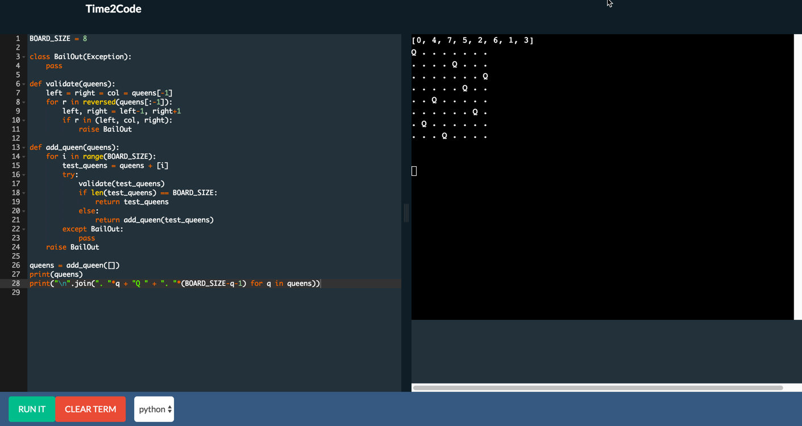

# Time2Code
A portable, scaleable web based code editor to integrate into your code learning experiences.

The goal is to make deploying your own web based code editor easier and more fun.

##Tech Overview
* The Code execution backend is built off of the serverless [FaaS](http://docs.get-faas.com/) Framework for scalability and ability to support many languages.  Although support for [k8s](https://kubernetes.io/) is currently being tested on [faas-netes](https://github.com/alexellis/faas-netes) and this project and appears to be fairly successful, currently primary support is on Docker Swarm.

* Web site is being driven by the [Flask](http://flask.pocoo.org/) Framework as a Swarm service.

* Code editor is built from [Ace Editor](https://ace.c9.io/) project.

* Terminal is built from [XTermJS](https://xtermjs.org/).

## Up and Running

The following snippet will initialize your swarm, Time2Code, FaaS and Time2code functions.

```sh
docker swarm init --advertise-addr eth0 && \
  git clone https://github.com/JockDaRock/Time2Code && \
  cd Time2Code && \
  ./time2deploy.sh && \
  docker service ls
```

If you are on your laptop navigate to http://127.0.0.1:5555 and start coding.



### Coding Languages Currently Supported

* Python, Golang... more coming very soon.

